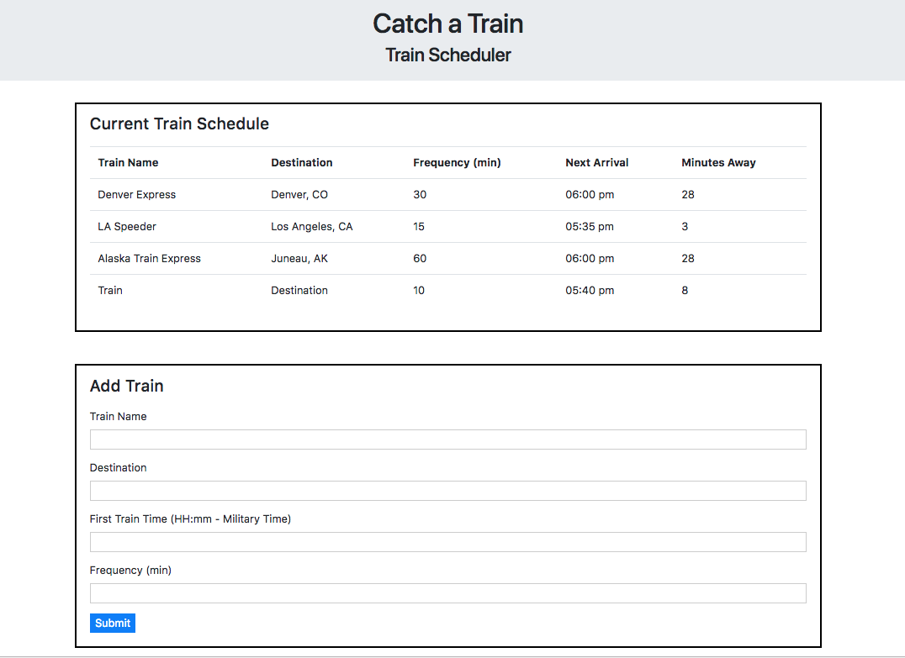

## Train-Scheduler
Description: This website asks for a train name, destination, first train arrival, and frequencey and displays the results in a train table. The results show the next arrival time and how many minutes away the train is. The data is persistent (firebase).

______________
______________
______________
## Visit the deployed version of Train-Scheduler
[Train-Scheduler](https://oserenchenko.github.io/Train-Scheduler/)



______________
______________
______________

## Getting Started
to install locally run this command in your terminal
```
git clone https://github.com/oserenchenko/Train-Scheduler.git
```
once inside the Train-Scheduler folder, open the index.html in your preferred web browser

## Built With
* HTML - website structure
* [CSS](https://css-tricks.com/) - styling
* [Bootstrap](https://getbootstrap.com/) - styling framework
* [Javascript](https://www.javascript.com/) - website logic
* [jQuery](https://jquery.com/) - manipulating the DOM
* [Firebase](https://firebase.google.com/) - database and object modeling

______________
______________
______________
## Authors
* [Olga Serenchenko](https://github.com/oserenchenko)

______________
______________
______________
## License
This project is licensed under the MIT License - see the [LICENSE.md](LICENSE.md) file for details
